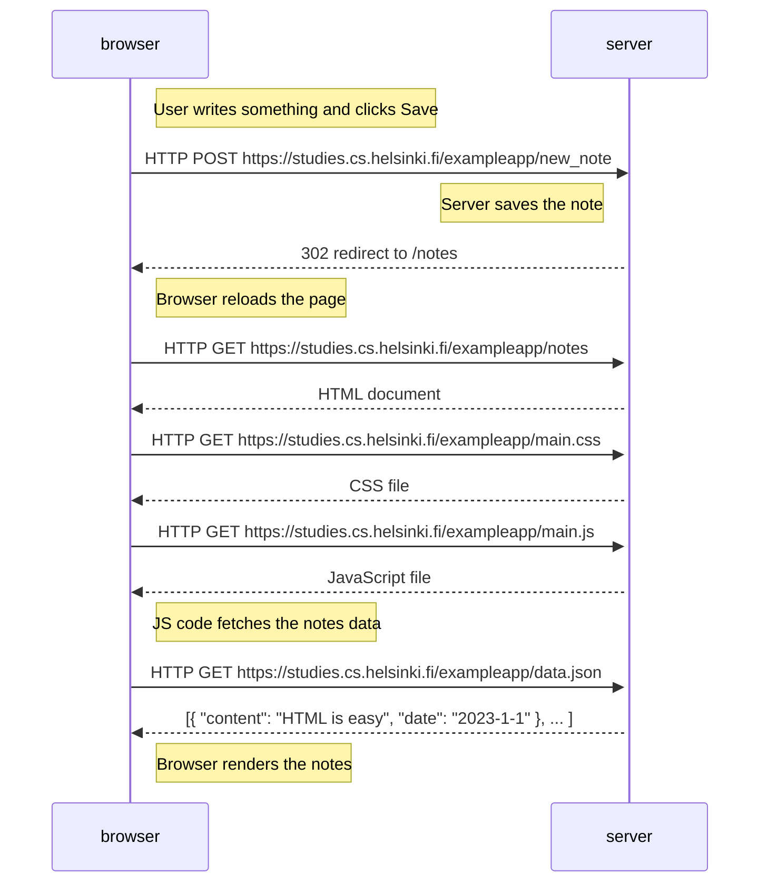

```mermaid
sequenceDiagram
participant browser
participant server

    Note right of browser: User writes something and clicks Save

    browser->>server: HTTP POST https://studies.cs.helsinki.fi/exampleapp/new_note
    activate server
    Note left of server: Server saves the note
    server-->>browser: 302 redirect to /notes

    Note right of browser: Browser reloads the page

    browser->>server: HTTP GET https://studies.cs.helsinki.fi/exampleapp/notes
    activate server
    server-->>browser: HTML document

    browser->>server: HTTP GET https://studies.cs.helsinki.fi/exampleapp/main.css
    activate server
    server-->>browser: CSS file

    browser->>server: HTTP GET https://studies.cs.helsinki.fi/exampleapp/main.js
    activate server
    server-->>browser: JavaScript file

    Note right of browser: JS code fetches the notes data

    browser->>server: HTTP GET https://studies.cs.helsinki.fi/exampleapp/data.json
    activate server
    server-->>browser: [{ "content": "HTML is easy", "date": "2023-1-1" }, ... ]

    Note right of browser: Browser renders the notes
```
