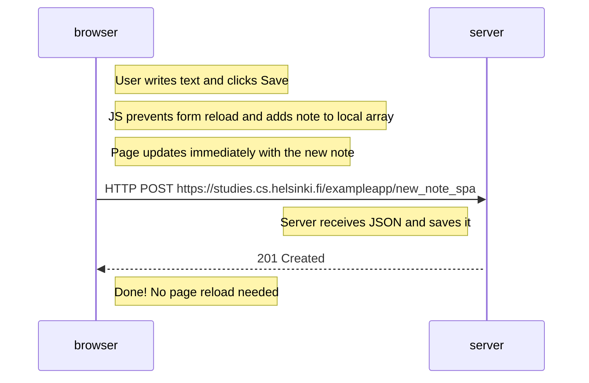

```mermaid
sequenceDiagram
participant browser
participant server

    Note right of browser: User writes text and clicks Save

    Note right of browser: JS prevents form reload and adds note to local array
    Note right of browser: Page updates immediately with the new note

    browser->>server: HTTP POST https://studies.cs.helsinki.fi/exampleapp/new_note_spa
    activate server
    Note left of server: Server receives JSON and saves it
    server-->>browser: 201 Created

    Note right of browser: Done! No page reload needed
```
